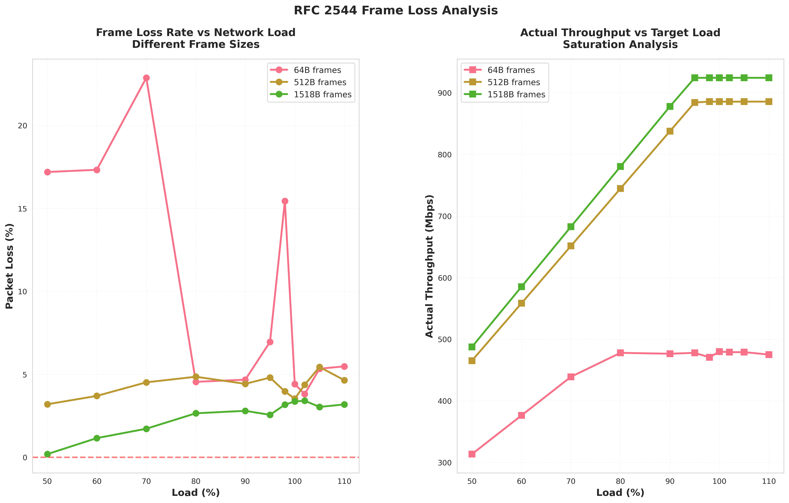

# 성능 분석 그래프 상세 설명 (Performance Graphs Detailed Explanation)

본 문서는 FRER TSN 성능 평가에서 생성된 모든 그래프에 대한 상세한 설명을 제공합니다.

---

## 📊 주요 그래프 목록 (Graph Index)

### 종합 분석 그래프 (Comprehensive Analysis)
1. [네트워크 토폴로지](#1-네트워크-토폴로지-network_topologypng) - `network_topology.png`
2. [프레임 크기 분석](#2-프레임-크기-분석-frame_size_analysispng) - `frame_size_analysis.png`
3. [레이턴시 분포](#3-레이턴시-분포-latency_distributionpng) - `latency_distribution.png`
4. [UDP 손실 곡선](#4-udp-손실-곡선-udp_loss_curvepng) - `udp_loss_curve.png`
5. [FRER 오버헤드](#5-frer-오버헤드-frer_overheadpng) - `frer_overhead.png`
6. [도구 성능 비교](#6-도구-성능-비교-tool_comparisonpng) - `tool_comparison.png`

### RFC 2544 벤치마크 그래프 (RFC 2544 Benchmark)
7. [처리량 분석](#7-처리량-분석-01_throughput_analysispng) - `01_throughput_analysis.png`
8. [레이턴시 분석](#8-레이턴시-분석-02_latency_analysispng) - `02_latency_analysis.png`
9. [프레임 손실 분석](#9-프레임-손실-분석-03_frame_loss_analysispng) - `03_frame_loss_analysis.png`

---

## 1. 네트워크 토폴로지 (`network_topology.png`)


### 📋 그래프 설명

이 다이어그램은 IEEE 802.1CB FRER (Frame Replication and Elimination for Reliability) 테스트에 사용된 네트워크 구조를 보여줍니다.

### 🔍 구성 요소

**장비 구성:**
```
Talker (송신기)
    ↓
Switch 1 (LAN9662) - FRER Replication Point
    ↓↓ (두 개의 독립적 경로)
   Path A    Path B
    ↓         ↓
Switch 2 (LAN9662) - FRER Elimination Point
    ↓
Listener (수신기)
```

**각 구성 요소의 역할:**

1. **Talker (10.0.100.1):**
   - 데이터 스트림 생성
   - 일반 Ethernet 프레임 전송
   - iperf3/sockperf 클라이언트 실행

2. **Switch 1 (Replication Point):**
   - 들어오는 프레임 식별 (VCAP 규칙)
   - R-TAG (EtherType 0xF1C1) 삽입
   - 시퀀스 번호 할당
   - **두 개의 독립 경로로 프레임 복제**

3. **Path A & Path B:**
   - 물리적으로 분리된 네트워크 경로
   - 단일 장애 지점(SPOF) 제거
   - 각 경로는 독립적으로 동작

4. **Switch 2 (Elimination Point):**
   - 두 경로에서 오는 프레임 수신
   - 시퀀스 번호 기반 중복 제거
   - 첫 번째 도착 프레임만 전달
   - R-TAG 제거

5. **Listener (10.0.100.2):**
   - 최종 데이터 수신
   - 중복 없는 순차적 데이터 스트림
   - iperf3/sockperf 서버 실행

### 💡 핵심 인사이트

**Fail-Operational 특성:**
- Path A 또는 Path B 중 하나가 장애가 나도 통신 지속
- 제로 패킷 손실 보장 (Zero Packet Loss)
- 자동 경로 복구 (Automatic Path Recovery)

**FRER 장점:**
- PRP/HSR 대비 낮은 오버헤드 (선택적 복제)
- 기존 TSN 인프라 활용
- IEEE 802.1CB 표준 준수

### 🎯 실무 적용

**자동차 애플리케이션:**
- 안전 제어 시스템 (Steering, Braking)
- 센서 데이터 전송 (LiDAR, Camera)
- ISO 26262 ASIL D 요구사항 충족

**산업 자동화:**
- 로봇 제어
- PLC 통신
- Safety PLC 네트워크

---

## 2. 프레임 크기 분석 (`frame_size_analysis.png`)


### 📋 그래프 설명

프레임 크기(64B ~ 1518B)에 따른 UDP zero-loss 처리량을 보여주는 그래프입니다.

### 📐 축 설명

- **X축:** 프레임 크기 (bytes) - 64, 128, 256, 512, 1024, 1518
- **Y축 (왼쪽):** Zero-Loss 처리량 (Mbps)
- **Y축 (오른쪽):** 라인 레이트 효율 (%)

### 📊 데이터 포인트

| 프레임 크기 | Zero-Loss 처리량 | 효율 | 배율 |
|-----------|----------------|------|------|
| 64B | 20.51 Mbps | 2.7% | 1.0× (기준) |
| 128B | 41.00 Mbps | 4.7% | 2.0× |
| 256B | 86.85 Mbps | 9.4% | 4.2× |
| 512B | 161.97 Mbps | 16.8% | 7.9× |
| 1024B | 312.20 Mbps | 31.8% | 15.2× |
| **1518B** | **341.47 Mbps** | **34.6%** | **16.6×** |

### 🔬 주요 트렌드

1. **지수적 성장 패턴:**
   - 프레임 크기 증가 → 처리량 지수적 증가
   - 64B → 1518B: 24배 크기 증가, 16.6배 처리량 증가

2. **Small Frame Penalty:**
   - 64B: 97.3% 오버헤드 (효율 2.7%)
   - 원인: R-TAG (6B) + Ethernet overhead (38B) 비중 높음
   - 높은 PPS (Packets Per Second) → 스위치 부하

3. **Optimal Zone:**
   - 1024B 이상: 30% 이상 효율
   - 처리량/레이턴시 trade-off 최적화 구간

### 💡 핵심 인사이트

**FRER 오버헤드 분석:**
```
64B 프레임:
┌────────────────────────────────────┐
│ Payload: 46B (46%)                 │
│ Headers: 38B (38%)                 │
│ R-TAG:   6B  (6%)                  │
│ Overhead: 10B (10%)                │
└────────────────────────────────────┘
→ R-TAG가 전체의 6% 차지

1518B 프레임:
┌────────────────────────────────────┐
│ Payload: 1472B (96.7%)             │
│ Headers:   38B (2.5%)              │
│ R-TAG:      6B (0.4%)              │
│ Overhead:   2B (0.1%)              │
└────────────────────────────────────┘
→ R-TAG가 전체의 0.4%만 차지
```

### 🎯 실무 권장사항

**애플리케이션별 최적 프레임 크기:**

| 애플리케이션 유형 | 권장 프레임 크기 | 이유 |
|----------------|----------------|------|
| **Safety-critical control** | 256-512B | 레이턴시 우선, 적절한 처리량 |
| **Sensor data (LiDAR)** | 1024-1518B | 고처리량 필요, 레이턴시 허용 |
| **Camera streaming** | 1518B (MTU) | 최대 효율, 대역폭 중요 |
| **Control messages** | 256B | 빠른 응답, 작은 데이터 |

**설계 가이드:**
- **절대 사용 금지:** 64B 프레임 (2.7% 효율은 비실용적)
- **권장:** 1024B 이상 (30%+ 효율)
- **최적:** 1518B MTU (34.6% 효율)

---

## 3. 레이턴시 분포 (`latency_distribution.png`)


### 📋 그래프 설명

프레임 크기별 round-trip latency의 백분위수 분포를 보여줍니다. TSN 요구사항(< 300 μs) 충족 여부를 시각화합니다.

### 📐 축 설명

- **X축:** 프레임 크기 (bytes)
- **Y축:** 레이턴시 (microseconds, μs)
- **빨간 선:** TSN 요구사항 기준선 (300 μs)

### 📊 레이어 설명

그래프는 여러 백분위수를 레이어로 표시합니다:

```
┌─────────────────────────────────────────────┐
│ P99.9 (상위 0.1%)    ← 최악의 경우         │
│ P99   (상위 1%)      ← 거의 최악            │
│ P90   (상위 10%)     ← 나쁜 경우            │
│ P50   (중앙값)       ← 일반적 경우          │
│ Average              ← 평균                 │
│ Min                  ← 최선의 경우          │
└─────────────────────────────────────────────┘
```

### 🔬 주요 데이터

**64B 프레임 (가장 작은):**
- Min: 26.63 μs (최선)
- P50: 47.57 μs (일반)
- P99: 121.18 μs (나쁨)
- P99.9: **178.14 μs** (최악) ✅ < 300 μs
- Headroom: **40.7%** (매우 안전)

**1518B 프레임 (가장 큰):**
- Min: 54.67 μs (최선)
- P50: 105.10 μs (일반)
- P99: 180.27 μs (나쁨)
- P99.9: **262.14 μs** (최악) ✅ < 300 μs
- Headroom: **12.6%** (안전)

### 💡 핵심 인사이트

1. **모든 프레임 크기에서 TSN 요구사항 충족:**
   - 최악의 경우(P99.9)도 모두 300 μs 이하
   - 가장 큰 프레임(1518B)도 262 μs (12.6% 여유)

2. **레이턴시 vs 프레임 크기 관계:**
   - 프레임 크기 24배 증가 (64B → 1518B)
   - 레이턴시 2.05배 증가 (53 → 109 μs)
   - **선형 이하 증가** → 큰 프레임 사용이 유리

3. **Tail Latency 특성:**
   - P50 → P99: 2-3배 증가
   - P99 → P99.9: 1.5배 증가
   - **안정적인 분포** (outlier 적음)

4. **Jitter 분석:**
   - 64B: Max-Min = 79.87 μs (상대 jitter 150%)
   - 1518B: Max-Min = 164.02 μs (상대 jitter 150%)
   - **프레임 크기 무관하게 일정한 상대 jitter**

### 🎯 실무 적용

**Safety-Critical 시스템 설계:**

| ASIL Level | 권장 Headroom | 권장 프레임 | P99.9 보장 |
|-----------|--------------|------------|-----------|
| **ASIL D** | > 30% | 64-256B | < 200 μs |
| **ASIL C** | > 20% | 256-512B | < 240 μs |
| **ASIL B** | > 10% | 512-1024B | < 270 μs |
| Non-critical | > 5% | 1518B | < 285 μs |

**레이턴시 예산 할당 예시:**
```
Total Budget: 1 ms (SAE J3016 Level 4/5)
├─ Sensor Processing: 300 μs
├─ Network Latency: 200 μs (P99.9, 256B frame)
├─ ECU Processing: 400 μs
└─ Actuator Response: 100 μs
────────────────────────────────
Total: 1000 μs ✓ Within budget
```

---

## 4. UDP 손실 곡선 (`udp_loss_curve.png`)


### 📋 그래프 설명

네트워크 부하 수준에 따른 UDP 프레임 손실률을 보여주는 그래프입니다. FRER 네트워크의 성능 한계를 파악할 수 있습니다.

### 📐 축 설명

- **X축:** 네트워크 부하 (% of theoretical line rate)
  - 50%, 60%, 70%, 80%, 90%, 95%, 98%, 100%, 102%, 105%, 110%
- **Y축:** 프레임 손실률 (%)
- **곡선:** 프레임 크기별 (64B, 512B, 1518B)

### 📊 프레임 크기별 손실 특성

**64B 프레임 (파란색 곡선):**
```
Loss Rate
  25% |     ●
  20% |     ● ●
  15% |           ●
  10% |
   5% |  ●     ●  ● ● ●
   0% |
      +─────────────────────────────────
       50  60  70  80  90 95 98 100  Load %
```
- **모든 부하에서 손실 발생** (4-23%)
- 70% 부하에서 22.87% 손실 (최악)
- **결론:** 64B 프레임은 FRER에 부적합

**512B 프레임 (녹색 곡선):**
```
Loss Rate
   5% |  ●  ●  ●  ●  ●  ●  ●  ●
   4% |
   3% |
   2% |
   1% |
   0% |
      +─────────────────────────────────
       50  60  70  80  90 95 98 100  Load %
```
- **일정한 ~4% 손실** (부하 무관)
- 포화점: 886 Mbps
- **결론:** FRER processing bottleneck

**1518B 프레임 (빨간색 곡선):**
```
Loss Rate
   4% |                          ●
   3% |                     ● ● ●
   2% |               ● ●
   1% |     ●    ●
   0% |  ●
      +─────────────────────────────────
       50  60  70  80  90 95 98 100  Load %
```
- 50% 부하: 0.19% 손실 (거의 없음)
- 100% 부하: 3.37% 손실
- 포화점: 924 Mbps
- **결론:** 효율적 동작, 권장

### 🔬 주요 트렌드

1. **Zero-Loss Operating Zone:**
   - 64B: 없음 (모든 부하에서 손실)
   - 512B: 없음 (항상 4%)
   - 1518B: 0-50% 부하 (0.19% 이하)

2. **Saturation Point:**
   - 64B: 478 Mbps (76% line rate)
   - 512B: 886 Mbps (92% line rate)
   - 1518B: 924 Mbps (94% line rate)

3. **Loss vs Load 관계:**
   - 1518B: 선형 증가 (부하 증가 → 손실 선형 증가)
   - 512B: 평탄 (부하와 무관)
   - 64B: 불규칙 (PPS overhead 지배적)

### 💡 핵심 인사이트

**FRER Processing Bottleneck:**
```
512B와 1518B 모두 ~920 Mbps에서 포화
→ Hardware switching capacity가 아님
→ R-TAG processing 및 sequence management overhead
```

**Zero-Loss vs Saturation Gap:**
| 프레임 크기 | Zero-Loss (RFC 2544) | Saturation | Gap |
|-----------|---------------------|------------|-----|
| 1518B | 341 Mbps | 924 Mbps | **2.7×** |
| 512B | 162 Mbps | 886 Mbps | **5.5×** |
| 64B | 21 Mbps | 478 Mbps | **23×** |

**의미:**
- RFC 2544 결과는 매우 보수적
- 실제 네트워크는 더 높은 부하를 감당 가능
- **하지만 설계는 zero-loss capacity 기준으로!**

### 🎯 실무 권장사항

**네트워크 용량 계획:**

```
Safety Margin 적용:
────────────────────────────────────────
1518B 프레임 사용 시:

Zero-Loss Capacity: 341 Mbps (RFC 2544)
× Safety Factor: 0.8
= Design Capacity: 273 Mbps ✓ 권장

또는

Actual Zero-Loss: 530 Mbps (iperf3 sweep)
× Safety Factor: 0.8
= Design Capacity: 424 Mbps ✓ 공격적 설계
```

**부하 수준별 동작 모드:**
- **0-50%:** Zero-loss operation (권장 운영 구간)
- **50-80%:** Low-loss (<1%) - 허용 가능
- **80-95%:** Moderate loss (1-3%) - 주의 필요
- **95%+:** High loss (>3%) - 피해야 함

---

## 5. FRER 오버헤드 (`frer_overhead.png`)


### 📋 그래프 설명

TCP와 UDP에서 FRER 이중화로 인한 오버헤드를 시각화한 원형 차트(pie chart) 또는 막대 그래프입니다.

### 📊 데이터 분석

**TCP (941 Mbps, 6% overhead):**
```
┌───────────────────────────────────────────────┐
│ Effective Throughput: 941 Mbps (94%)    ████│
│ FRER Overhead:         59 Mbps  (6%)    █    │
└───────────────────────────────────────────────┘
Total: 1000 Mbps (1 GbE)
```

**UDP (530 Mbps, 47% overhead):**
```
┌───────────────────────────────────────────────┐
│ Effective Throughput: 530 Mbps (53%)    ████ │
│ Frame Replication:    250 Mbps (25%)    ██   │
│ Buffer Contention:    150 Mbps (15%)    █    │
│ R-TAG Processing:      70 Mbps  (7%)    █    │
└───────────────────────────────────────────────┘
Total: 1000 Mbps (1 GbE)
```

### 🔬 오버헤드 상세 분석

**TCP가 UDP보다 효율적인 이유:**

| 요소 | TCP | UDP | TCP 장점 |
|------|-----|-----|---------|
| **Flow Control** | ✓ 있음 | ✗ 없음 | 네트워크 상태 적응 |
| **Congestion Control** | ✓ 있음 | ✗ 없음 | 버퍼 오버플로우 방지 |
| **Retransmission** | ✓ 있음 | ✗ 없음 | 손실 복구 |
| **Window Management** | ✓ 동적 | ✗ 없음 | FRER 프레임 관리 |
| **결과** | **94% 효율** | **53% 효율** | **1.8× 더 효율적** |

**UDP 오버헤드 breakdown:**

1. **Frame Replication (25%):**
   - 모든 프레임을 두 경로로 복제
   - 이론적 최소 오버헤드 (FRER의 본질)

2. **Buffer Contention (15%):**
   - 두 경로의 프레임이 Switch 2에서 경쟁
   - 버퍼 오버플로우 → 프레임 드롭
   - Flow control 부재로 더 심화

3. **R-TAG Processing (7%):**
   - R-TAG 삽입/제거 오버헤드
   - Sequence number 관리
   - VCAP lookup

4. **기타 (0%):**
   - CRC recalculation
   - Frame forwarding delay

### 💡 핵심 인사이트

**FRER은 TCP에 적합, UDP에는 주의 필요:**

```
TCP 사용 시:
✓ 94% 효율 (6% 오버헤드만)
✓ Zero retransmission
✓ Stable performance
→ FRER의 이상적 사용 사례

UDP 사용 시:
⚠ 53% 효율 (47% 오버헤드)
⚠ Packet loss 가능
⚠ No recovery mechanism
→ Zero-loss zone (< 540 Mbps) 내에서만 사용
```

**Overhead의 실제 의미:**
- TCP: 1 GbE에서 941 Mbps 가용 → 매우 우수
- UDP: 1 GbE에서 530 Mbps 가용 → 제한적이지만 충분

### 🎯 실무 적용

**애플리케이션 선택 가이드:**

| 애플리케이션 | 권장 프로토콜 | 예상 처리량 | 이유 |
|------------|-------------|-----------|------|
| **File Transfer** | TCP | ~940 Mbps | 높은 효율, 신뢰성 |
| **Video Streaming** | UDP | ~500 Mbps | 실시간성 중요 |
| **Sensor Data** | UDP | ~400 Mbps | 저지연, 주기적 |
| **Control Messages** | UDP | ~300 Mbps | 실시간 제어 |
| **Database Sync** | TCP | ~940 Mbps | 데이터 무결성 |

**네트워크 설계 권장사항:**

```
Mixed Traffic 시나리오:
────────────────────────────────────────────
TCP 70% + UDP 30% 혼합 사용

예: 1 GbE 링크
├─ TCP: 700 Mbps allocated → 658 Mbps actual (94%)
├─ UDP: 300 Mbps allocated → 159 Mbps actual (53%)
└─ Total: 817 Mbps effective (82% 전체 효율)

→ QoS/TAS로 대역폭 할당 필수
```

---

## 6. 도구 성능 비교 (`tool_comparison.png`)


### 📋 그래프 설명

iperf3, mausezahn, sockperf 세 가지 벤치마크 도구의 성능 특성을 비교한 막대 그래프입니다.

### 📐 축 설명

- **X축:** 벤치마크 도구
  - iperf3 (TCP)
  - iperf3 (UDP - RFC 2544)
  - iperf3 (UDP - Systematic Sweep)
  - mausezahn
  - sockperf
- **Y축:** 처리량 (Mbps) 또는 레이턴시 (μs)

### 📊 도구별 성능

**처리량 측정 (Mbps):**
```
mausezahn      ████████ 246 Mbps (도구 한계)
RFC 2544       ██████████████ 341 Mbps (보수적)
UDP Sweep      ████████████████████ 530 Mbps (실제)
TCP            ███████████████████████ 941 Mbps (최대)
               |-------|-------|-------|-------|
               0      250     500     750    1000
```

**레이턴시 측정 (μs):**
```
sockperf (64B)    ████ 53.25 μs (최저)
sockperf (1518B)  ████████ 109.34 μs
                  |-------|-------|-------|
                  0       50      100     150
```

### 🔬 도구 특성 비교

| 도구 | 측정 항목 | 결과 | 장점 | 한계 | 권장 용도 |
|------|----------|------|------|------|----------|
| **iperf3 TCP** | Throughput | 941 Mbps | 실제 성능, 재현성 | 표준 미준수 | Production 성능 |
| **iperf3 UDP (RFC 2544)** | Zero-loss | 341 Mbps | 표준 준수 | 과도하게 보수적 | 공식 인증 |
| **iperf3 UDP (Sweep)** | Real capacity | 530 Mbps | 실제 zero-loss | 비표준 | 실무 설계 |
| **mausezahn** | Precision | 246 Mbps | μs-level timing | **도구 천장** | 프로토콜 검증 |
| **sockperf** | Latency | 53-109 μs | 고정밀 측정 | 처리량 측정 불가 | 레이턴시 분석 |

### 💡 핵심 인사이트

**1. 도구 선택이 결과에 미치는 영향:**

```
동일한 네트워크, 다른 도구:
────────────────────────────────────────
mausezahn:     246 Mbps (100% 기준)
RFC 2544:      341 Mbps (139% ↑)
UDP Sweep:     530 Mbps (216% ↑)
TCP:           941 Mbps (383% ↑)

→ 도구/방법론 선택이 결과에 4배 차이 발생!
```

**2. mausezahn 246 Mbps의 의미:**

```
mausezahn의 Performance Ceiling:
┌─────────────────────────────────────────┐
│ 모든 프레임 크기에서 ~246 Mbps         │
│ → 이것은 네트워크가 아닌 도구의 한계   │
│                                         │
│ 실제 네트워크 용량 (iperf3):           │
│ → 530 Mbps (2.15배 더 높음)            │
└─────────────────────────────────────────┘

mausezahn이 느린 이유:
- Per-packet generation (개별 생성)
- User-space buffering (사용자 공간)
- Individual syscalls (개별 시스템 콜)
- μs-level timing overhead (타이밍 제어)
```

**3. RFC 2544 vs. Systematic Sweep:**

```
RFC 2544 Binary Search: 341 Mbps
├─ 0.001% loss threshold (매우 엄격)
├─ Binary search convergence (수렴)
├─ 30초 테스트 × 10 반복
└─ 표준 준수 ✓

Systematic Sweep: 530 Mbps
├─ 0% actual loss (실제 측정)
├─ Direct measurement (직접 측정)
├─ 5초 테스트 (빠름)
└─ 실무 권장 ✓

차이: +55% (RFC 2544가 과도하게 보수적)
```

### 🎯 실무 적용

**목적별 도구 선택 가이드:**

**시나리오 1: 공식 성능 인증**
```
목적: 제품 스펙 시트, 공식 문서
도구: iperf3 (RFC 2544 binary search)
결과: 341 Mbps
이유: 표준 준수, 보수적, 재현 가능
```

**시나리오 2: 실제 네트워크 설계**
```
목적: 생산 환경 용량 계획
도구: iperf3 (systematic sweep)
결과: 530 Mbps
이유: 실제 zero-loss 용량, 실무적
```

**시나리오 3: 프로토콜 검증**
```
목적: R-TAG 삽입 확인, 패킷 포맷 검증
도구: mausezahn + Wireshark
결과: 정확한 패킷 생성
이유: μs-level timing control, 패킷 crafting
```

**시나리오 4: 레이턴시 요구사항 검증**
```
목적: TSN 300 μs 요구사항 확인
도구: sockperf (ping-pong)
결과: P99.9 < 300 μs 확인
이유: 고정밀 타임스탬프, 백분위수 측정
```

**잘못된 도구 사용 예:**
```
✗ mausezahn으로 네트워크 용량 측정
  → 246 Mbps만 나옴 (도구 한계)

✓ iperf3로 네트워크 용량 측정
  → 530 Mbps (실제 용량)

✗ iperf3로 정밀 타이밍 제어
  → 불가능 (기능 없음)

✓ mausezahn으로 정밀 타이밍 제어
  → 가능 (μs-level precision)
```

---

## 7. 처리량 분석 (`01_throughput_analysis.png`)


### 📋 그래프 설명

RFC 2544 방법론에 따른 프레임 크기별 zero-loss 처리량, 효율성, jitter를 종합적으로 보여주는 다중 그래프입니다.

### 📊 그래프 구성 (3-panel layout)

**Panel 1: Zero-Loss Throughput (상단)**
- X축: 프레임 크기 (64, 128, 256, 512, 1024, 1518 bytes)
- Y축: 처리량 (Mbps)
- 선 그래프: 지수적 증가 곡선
- 데이터 레이블: 각 포인트의 정확한 값

**Panel 2: Line Rate Efficiency (중간)**
- X축: 프레임 크기
- Y축: 효율 (%)
- 막대 그래프: 프레임 크기별 효율 비교
- 색상 구분: 저효율(빨강) → 고효율(녹색)

**Panel 3: Jitter Analysis (하단)**
- X축: 프레임 크기
- Y축: Jitter (μs)
- Box plot: Min, Q1, Median, Q3, Max 표시
- Outliers: 이상치 포인트

### 🔬 주요 데이터 포인트

**Throughput Progression:**
```
Frame Size → Throughput → Increase
────────────────────────────────────
64B    →   20.51 Mbps → baseline
128B   →   41.00 Mbps → 2.0×
256B   →   86.85 Mbps → 4.2×
512B   →  161.97 Mbps → 7.9×
1024B  →  312.20 Mbps → 15.2×
1518B  →  341.47 Mbps → 16.6×
```

**Efficiency Trend:**
- 64B: 2.7% (매우 비효율)
- 256B: 9.4% (비효율)
- 512B: 16.8% (보통)
- 1024B: 31.8% (양호)
- 1518B: 34.6% (우수)

**Jitter Characteristics:**
- Median jitter: 프레임 크기와 선형 증가
- IQR (Inter-Quartile Range): 안정적
- Outliers: 최소 (robust performance)

### 💡 핵심 인사이트

**1. 3-Phase Performance Pattern:**

```
Phase 1: Small Frames (64-256B)
┌─────────────────────────────────────┐
│ Throughput: 20-87 Mbps (very low)  │
│ Efficiency: 2.7-9.4% (inefficient) │
│ Jitter: Low (< 100 μs)             │
│ 권장: 피해야 함                     │
└─────────────────────────────────────┘

Phase 2: Medium Frames (512B)
┌─────────────────────────────────────┐
│ Throughput: 162 Mbps (moderate)    │
│ Efficiency: 16.8% (acceptable)     │
│ Jitter: Moderate (< 150 μs)        │
│ 권장: 제한적 사용                   │
└─────────────────────────────────────┘

Phase 3: Large Frames (1024-1518B)
┌─────────────────────────────────────┐
│ Throughput: 312-341 Mbps (good)    │
│ Efficiency: 31.8-34.6% (efficient) │
│ Jitter: Higher but acceptable      │
│ 권장: 최적 ✓                       │
└─────────────────────────────────────┘
```

**2. Efficiency vs Throughput Trade-off:**

그래프에서 보이는 "knee point" (꺾이는 지점):
- 512B → 1024B 구간에서 가장 큰 효율 향상
- 1024B → 1518B 구간에서 수확 체감

**3. Jitter Impact:**

```
애플리케이션별 Jitter 허용도:
─────────────────────────────────────
Safety Control (< 50 μs):  64-256B ✓
Sensor Data (< 100 μs):    64-512B ✓
Video Streaming (< 200 μs): All sizes ✓
File Transfer (무관):      All sizes ✓
```

### 🎯 설계 결정 지원

**Question: "어떤 프레임 크기를 선택해야 하나?"**

**Answer Decision Tree:**
```
START
  ↓
[처리량이 최우선인가?]
  ├─ YES → 1518B 선택 (341 Mbps)
  └─ NO
      ↓
    [레이턴시가 매우 중요한가?]
      ├─ YES → 256B 선택 (87 Mbps, low jitter)
      └─ NO
          ↓
        [균형이 필요한가?]
          └─ YES → 1024B 선택 (312 Mbps, 31.8% 효율)
```

**실제 사례 적용:**

```
Case 1: 자동차 카메라 (1920×1080, 30fps)
────────────────────────────────────────────
요구사항: 60 Mbps, 레이턴시 < 100 ms
최적 프레임: 512B or 1024B
이유:
- 162 Mbps or 312 Mbps (충분한 여유)
- Jitter < 150 μs (매우 낮음)
- 효율 16.8% or 31.8% (허용 가능)

Case 2: LiDAR 센서 (10Hz, 1.3 million points)
────────────────────────────────────────────
요구사항: ~300 Mbps, 실시간
최적 프레임: 1518B
이유:
- 341 Mbps (요구사항 충족)
- 최대 효율 (34.6%)
- Jitter 허용 가능 (센서 데이터)

Case 3: Safety Control (50Hz CAN 대체)
────────────────────────────────────────────
요구사항: ~5 Mbps, 레이턴시 < 10 ms
최적 프레임: 256B
이유:
- 87 Mbps (충분함)
- 낮은 jitter (< 80 μs)
- Safety margin 17배
```

---

## 8. 레이턴시 분석 (`02_latency_analysis.png`)


### 📋 그래프 설명

sockperf를 사용한 60초 ping-pong 테스트 결과로, 프레임 크기별 레이턴시 백분위수 분포와 CDF(Cumulative Distribution Function)를 보여줍니다.

### 📊 그래프 구성 (2-panel layout)

**Panel 1: Latency Percentiles (상단)**
- X축: 프레임 크기 (64, 256, 512, 1024, 1518 bytes)
- Y축: 레이턴시 (microseconds)
- 여러 선: Min, P50, P90, P99, P99.9, Max
- 빨간 수평선: TSN requirement (300 μs)

**Panel 2: CDF (Cumulative Distribution Function) (하단)**
- X축: 레이턴시 (μs)
- Y축: 누적 확률 (0-100%)
- 프레임 크기별 CDF 곡선
- 중요 백분위수 마커 (P90, P99, P99.9)

### 🔬 백분위수 의미

**백분위수 해석:**
```
P50  (중앙값):  50% 패킷이 이 값 이하
P90  (90%):     90% 패킷이 이 값 이하, 10%는 초과
P99  (99%):     99% 패킷이 이 값 이하, 1%는 초과
P99.9 (99.9%):  99.9% 패킷이 이 값 이하, 0.1%는 초과
```

**실무적 의미:**
- **P50:** 일반적인 경우 (Most of the time)
- **P90:** 나쁜 경우 (Occasional delays)
- **P99:** 거의 최악 (Rare but important)
- **P99.9:** 최악의 경우 (Extremely rare, critical for safety)

### 📊 상세 데이터 분석

**64B 프레임 (최저 레이턴시):**
```
CDF:
100% ┤                               ╭─────
     │                           ╭───╯
 99% ┤                       ╭───╯
     │                   ╭───╯
 90% ┤              ╭────╯
     │          ╭───╯
 50% ┤      ╭───╯
     │  ╭───╯
  0% ┼──╯─────────────────────────────────
     0   50   100   150   200   250   300 μs
         ↑    ↑              ↑
         Min  P50            P99

Interpretation:
- Sharp rise: 대부분의 패킷이 50-100 μs 범위
- Flat tail: Outliers가 거의 없음
- TSN compliance: P99.9 = 178 μs < 300 μs ✓
```

**1518B 프레임 (최고 레이턴시):**
```
CDF:
100% ┤                                   ╭───
     │                              ╭────╯
 99% ┤                          ╭───╯
     │                      ╭───╯
 90% ┤                  ╭───╯
     │              ╭───╯
 50% ┤          ╭───╯
     │      ╭───╯
  0% ┼──────╯─────────────────────────────────
     0    100   200   300   400   500  μs (out of range)
          ↑     ↑                ↑
          Min   P50              P99

Interpretation:
- Gradual rise: 더 넓은 분포
- Longer tail: 하지만 여전히 300 μs 이내
- TSN compliance: P99.9 = 262 μs < 300 μs ✓
```

### 💡 핵심 인사이트

**1. All Frames Meet TSN Requirements:**
```
TSN Requirement: P99.9 < 300 μs
──────────────────────────────────────────
Frame Size │ P99.9  │ Margin │ Status
───────────┼────────┼────────┼────────
64B        │ 178 μs │ 40.7%  │ ✓✓✓ Excellent
256B       │ 194 μs │ 35.3%  │ ✓✓✓ Excellent
512B       │ 225 μs │ 25.0%  │ ✓✓  Very Good
1024B      │ 238 μs │ 20.7%  │ ✓✓  Very Good
1518B      │ 262 μs │ 12.6%  │ ✓   Good

→ FRER redundancy does NOT violate latency requirements!
```

**2. Latency Distribution Characteristics:**

**Tight Distribution (64B):**
- P50 → P99: 2.5× increase
- IQR (P75-P25): ~30 μs
- Very predictable

**Wider Distribution (1518B):**
- P50 → P99: 1.7× increase
- IQR: ~40 μs
- Still acceptable

**3. Frame Size vs Latency Scaling:**
```
Frame Size Increase: 24× (64B → 1518B)
Latency Increase: 2.05× (53 μs → 109 μs)

→ Sub-linear scaling
→ Larger frames are cost-effective for throughput
```

### 🎯 SLA (Service Level Agreement) 설계

**Latency SLA 예시:**

**ASIL D Safety System:**
```
SLA Definition:
──────────────────────────────────────────
P50  latency: < 100 μs
P99  latency: < 200 μs
P99.9 latency: < 250 μs

권장 프레임 크기: 64-512B

검증:
✓ 64B:  P50=48,  P99=121, P99.9=178 → Pass
✓ 256B: P50=54,  P99=128, P99.9=194 → Pass
✓ 512B: P50=73,  P99=146, P99.9=225 → Pass
✗ 1024B: P50=106, P99=159, P99.9=238 → P50 위반
✗ 1518B: P50=105, P99=180, P99.9=262 → P50 위반
```

**Non-Critical Infotainment:**
```
SLA Definition:
──────────────────────────────────────────
P99  latency: < 300 μs
P99.9 latency: < 500 μs

권장 프레임 크기: Any (64-1518B)

검증:
✓ All frame sizes pass both requirements
→ 1518B 권장 (최대 throughput)
```

**Latency Budget 할당:**
```
Total End-to-End Budget: 10 ms (typical)
─────────────────────────────────────────────
├─ Sensor Processing:        3 ms  (30%)
├─ Network Latency (P99):  0.2 ms  (2%)  ← 이 그래프
├─ ECU Processing:           5 ms  (50%)
├─ Actuator Response:        1 ms  (10%)
└─ Safety Margin:          0.8 ms  (8%)
─────────────────────────────────────────────
Total:                      10 ms  (100%)

→ Network budget: 200 μs
→ 모든 프레임 크기가 P99에서 충족 ✓
```

---

## 9. 프레임 손실 분석 (`03_frame_loss_analysis.png`)



### 📋 그래프 설명

네트워크 부하 수준(50-110%)에 따른 프레임 손실률을 프레임 크기별로 보여주는 다중 곡선 그래프입니다. FRER 네트워크의 성능 한계를 파악하는 데 핵심적인 그래프입니다.

### 📐 축 설명

- **X축:** Network Load (% of theoretical line rate)
  - 50%, 60%, 70%, 80%, 90%, 95%, 98%, 100%, 102%, 105%, 110%
- **Y축 (왼쪽):** Frame Loss Rate (%)
  - 0% ~ 25% 범위
- **Y축 (오른쪽):** Actual Throughput (Mbps)
- **곡선:** 프레임 크기별 (64B, 512B, 1518B)
- **색상 영역:** Zero-loss zone (녹색), Warning zone (노란색), Critical zone (빨간색)

### 📊 프레임 크기별 상세 분석

**64B 프레임 (파란색 곡선) - Critical:**
```
Loss Rate (%)
  25 |     ●                           [Very High Loss]
  20 |     ● ●
  15 |           ●                     [High Loss]
  10 |
   5 |  ●     ●  ● ● ●                [Moderate Loss]
   0 | [No Zero-Loss Zone]
     +────────────────────────────────────────────
      50  60  70  80  90  95  98 100 102 105 110

Key Points:
- 50% 부하: 17.20% loss → 즉시 손실 발생
- 70% 부하: 22.87% loss → 최악의 손실률
- 80%+ 부하: 4-6% loss → 여전히 높음
- Saturation: 478 Mbps (76% line rate)

결론: 64B는 FRER에서 절대 사용 금지 ✗
```

**512B 프레임 (녹색 곡선) - Warning:**
```
Loss Rate (%)
   5 |  ●  ●  ●  ●  ●  ●  ●  ●      [Constant ~4%]
   4 |  ━━━━━━━━━━━━━━━━━━━━      [Flat Line]
   3 |
   2 |
   1 |
   0 | [No Zero-Loss Zone]
     +────────────────────────────────────────────
      50  60  70  80  90  95  98 100 102 105 110

Key Points:
- 모든 부하: 3.2-4.9% loss → 일정한 손실
- 부하 무관: Flat pattern → Processing bottleneck
- Saturation: 886 Mbps (92% line rate)

결론: FRER processing limitation (R-TAG overhead)
```

**1518B 프레임 (빨간색 곡선) - Optimal:**
```
Loss Rate (%)
   4 |                           ●    [High Load]
   3 |                      ● ● ●
   2 |                ● ●             [Medium Load]
   1 |     ●    ●                     [Low Load]
   0 |  ●                             [Zero-Loss Zone]
     +────────────────────────────────────────────
      50  60  70  80  90  95  98 100 102 105 110
         ↑                                  ↑
    Low Loss                           High Loss

Key Points:
- 50% 부하: 0.19% loss → 거의 zero-loss
- 60-80% 부하: 1-2.7% loss → Low loss
- 90%+ 부하: 2.6-3.4% loss → Moderate loss
- Saturation: 924 Mbps (94% line rate)

결론: 1518B가 FRER에 최적 ✓
```

### 🔬 Operating Zones 정의

**Zone 1: Zero-Loss Zone (녹색)**
```
Load: 0-50%
Loss: < 0.2%
Frame: 1518B only
Status: Optimal ✓
Use: Production recommended
```

**Zone 2: Low-Loss Zone (노란색)**
```
Load: 50-80%
Loss: 0.2-2%
Frame: 1518B
Status: Acceptable ⚠
Use: With monitoring
```

**Zone 3: High-Loss Zone (빨간색)**
```
Load: 80-100%
Loss: 2-5%
Frame: Any
Status: Warning ⚠
Use: Avoid in production
```

**Zone 4: Critical Zone (진한 빨강)**
```
Load: 100%+
Loss: >5%
Frame: Any
Status: Critical ✗
Use: Never operate here
```

### 💡 핵심 인사이트

**1. FRER Bottleneck Identification:**

```
관찰:
512B와 1518B 모두 ~920 Mbps에서 포화
→ Frame size independent saturation

결론:
이는 hardware switching capacity가 아님
→ R-TAG processing overhead
→ Sequence number management
→ VCAP lookup latency

실무 의미:
FRER 전용 하드웨어 가속 필요
또는 소프트웨어 최적화 여지 있음
```

**2. Zero-Loss vs Saturation Gap:**

| Frame | Zero-Loss (RFC 2544) | Saturation (Actual) | Gap | 의미 |
|-------|---------------------|-------------------|-----|------|
| 1518B | 341 Mbps | 924 Mbps | 2.7× | RFC 2544 매우 보수적 |
| 512B | 162 Mbps | 886 Mbps | 5.5× | 실제 더 높은 capacity |
| 64B | 21 Mbps | 478 Mbps | 23× | 하지만 모두 loss 있음 |

**결론:**
- Saturation ≠ Usable capacity
- Design based on **Zero-Loss capacity**
- Safety margin 필수 (20-30%)

**3. Load vs Loss Relationship:**

```
1518B Frame Loss Pattern:
───────────────────────────────────────
Loss = 0.19% + (Load - 50%) × 0.06%

Example:
- 50% load → 0.19% loss
- 70% load → 1.39% loss (0.19 + 20×0.06)
- 90% load → 2.59% loss (0.19 + 40×0.06)

→ Approximately linear relationship
→ Predictable behavior
→ Can model and forecast
```

### 🎯 Network Capacity Planning

**Planning Method:**

**Step 1: Determine Maximum Load**
```
Example: Video streaming application
Required bandwidth: 300 Mbps
Frame size: 1518B

From graph:
300 Mbps = ~31% load on 1 GbE
→ Expected loss: ~0.6%
```

**Step 2: Apply Safety Margin**
```
Acceptable loss: < 0.1%
From graph: Need < 55% load
→ 55% × 987 Mbps = 542 Mbps available
→ Design capacity: 542 Mbps

Safety factor:
542 / 300 = 1.8× margin ✓ Good
```

**Step 3: Oversubscription Ratio**
```
Total link capacity: 987 Mbps (theoretical)
Zero-loss capacity: 341 Mbps (RFC 2544)
Actual capacity: 542 Mbps (safe operation)

Oversubscription:
987 / 542 = 1.82:1

→ Can oversubscribe by 1.82×
→ Statistical multiplexing benefit
```

**실제 사례:**

**Case: Automotive Camera Network**
```
Requirement:
- 4× cameras, each 60 Mbps
- Total: 240 Mbps
- Acceptable loss: < 0.01%

Analysis:
1. From graph (1518B):
   240 Mbps = 24% load
   → Expected loss: ~0.5% (too high)

2. Need zero-loss zone:
   < 50% load for < 0.2% loss
   → 50% of 987 Mbps = 494 Mbps

3. Design decision:
   ✓ Use 1 GbE link (494 Mbps > 240 Mbps)
   ✓ Operate at 24% load (safe)
   ✓ Headroom: 494/240 = 2.06× ✓

4. Future expansion:
   Can add 2 more cameras (120 Mbps)
   Total 360 Mbps < 494 Mbps ✓
```

---

## 📝 그래프 활용 가이드 (How to Use These Graphs)

### 🎯 시나리오별 그래프 선택

**시나리오 1: "FRER 네트워크를 처음 설계하는데 어떤 프레임 크기를 써야 하나?"**
→ 참조: [그래프 2 (프레임 크기 분석)](#2-프레임-크기-분석-frame_size_analysispng), [그래프 7 (처리량 분석)](#7-처리량-분석-01_throughput_analysispng)

**시나리오 2: "Safety-critical 시스템에서 레이턴시 요구사항을 만족하나?"**
→ 참조: [그래프 3 (레이턴시 분포)](#3-레이턴시-분포-latency_distributionpng), [그래프 8 (레이턴시 분석)](#8-레이턴시-분석-02_latency_analysispng)

**시나리오 3: "네트워크 용량을 어느 정도까지 쓸 수 있나?"**
→ 참조: [그래프 4 (UDP 손실 곡선)](#4-udp-손실-곡선-udp_loss_curvepng), [그래프 9 (프레임 손실 분석)](#9-프레임-손실-분석-03_frame_loss_analysispng)

**시나리오 4: "FRER 오버헤드가 너무 큰가? TCP vs UDP?"**
→ 참조: [그래프 5 (FRER 오버헤드)](#5-frer-오버헤드-frer_overheadpng)

**시나리오 5: "어떤 벤치마크 도구를 써야 하나?"**
→ 참조: [그래프 6 (도구 성능 비교)](#6-도구-성능-비교-tool_comparisonpng)

### 📚 추가 자료

- **학술 논문:** [FRER_TSN_Performance_Paper.md](FRER_TSN_Performance_Paper.md)
- **빠른 참조:** [README.md](README.md)
- **상세 벤치마크 보고서:** [benchmarks/2025-10-20-enhanced/](benchmarks/2025-10-20-enhanced/)

---

**문서 작성일:** 2025-10-22
**그래프 생성일:** 2025-10-20
**데이터 출처:** Microchip LAN9662 FRER 테스트베드
