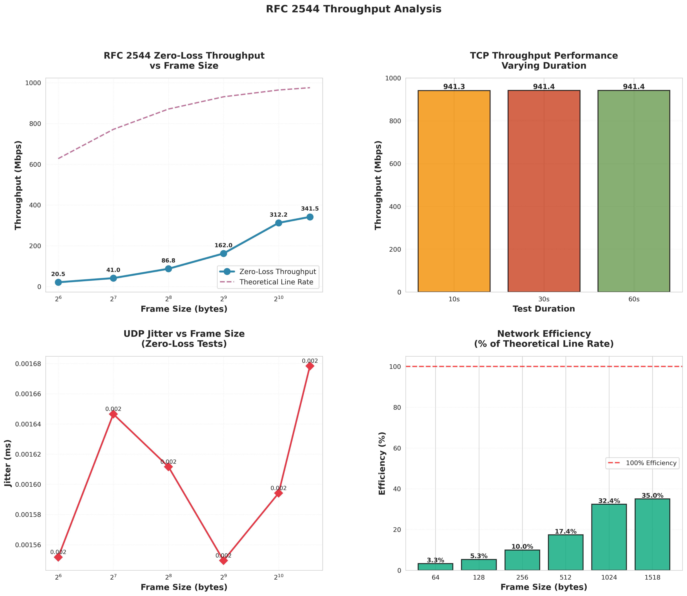
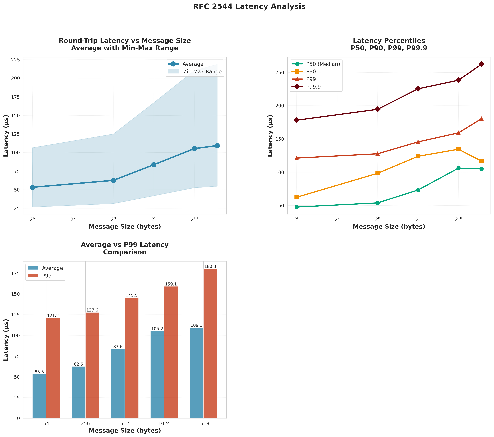

# RFC 2544 Network Benchmark Report (Enhanced)

**Target IP:** 10.0.100.2

**Interface:** enp2s0

**Test Date:** 2025-10-20 15:27:04

---

## Executive Summary

This report presents enhanced RFC 2544 compliant network benchmarking results using binary search methodology to determine zero-loss maximum throughput, detailed latency analysis with percentile breakdowns, and frame loss characterization curves.

### Key Performance Indicators

**TCP Performance:**

- Maximum Throughput: **941.42 Mbps**
- Retransmissions: **0 total**
- Stability: **Excellent**

**UDP Zero-Loss Performance:**

- Maximum Zero-Loss Throughput: **341.47 Mbps**
- Optimal Frame Size: **1518 bytes**
- Loss Threshold: **<0.001%** (RFC 2544 compliant)

**Latency Performance:**

- Minimum Average Latency: **53.25 μs**
- Minimum P99 Latency: **121.18 μs**
- Overall Rating: **Very Good (< 100 μs)**

---

## Test 1: Throughput - Zero-Loss Maximum Rate

Binary search methodology to find maximum throughput with <0.001% packet loss.

### UDP Zero-Loss Throughput Results

| Frame Size (B) | Throughput (Mbps) | Jitter (ms) | Loss (%) | Packets Sent |
|---------------:|------------------:|------------:|---------:|-------------:|
| 64.0 | 20.51 | 0.0016 | 0.0000 | 1201824.0 |
| 128.0 | 41.00 | 0.0016 | 0.0000 | 1201108.0 |
| 256.0 | 86.85 | 0.0016 | 0.0000 | 1272202.0 |
| 512.0 | 161.97 | 0.0015 | 0.0000 | 1186281.0 |
| 1024.0 | 312.20 | 0.0016 | 0.0000 | 1143320.0 |
| 1518.0 | 341.47 | 0.0017 | 0.0005 | 843552.0 |

### Network Efficiency Analysis

| Frame Size (B) | Theoretical (Mbps) | Actual (Mbps) | Efficiency (%) |
|---------------:|-------------------:|--------------:|---------------:|
| 64.0 | 627.45 | 20.51 | 3.3 |
| 128.0 | 771.08 | 41.00 | 5.3 |
| 256.0 | 870.75 | 86.85 | 10.0 |
| 512.0 | 930.91 | 161.97 | 17.4 |
| 1024.0 | 964.22 | 312.20 | 32.4 |
| 1518.0 | 975.58 | 341.47 | 35.0 |

### TCP Throughput Results

| Duration (s) | Throughput (Mbps) | Retransmits |
|-------------:|------------------:|------------:|
| 10 | 941.30 | 0 |
| 30 | 941.41 | 0 |
| 60 | 941.42 | 0 |

---

## Test 2: Latency - Round-Trip Time Analysis

### Detailed Latency Statistics

| Msg Size (B) | Avg (μs) | Min (μs) | Max (μs) | StdDev (μs) | P50 (μs) | P90 (μs) | P99 (μs) | P99.9 (μs) |
|-------------:|---------:|---------:|---------:|------------:|---------:|---------:|---------:|-----------:|
| 64 | 53.25 | 26.63 | 106.50 | 5.33 | 47.57 | 62.30 | 121.18 | 178.14 |
| 256 | 62.51 | 31.25 | 125.02 | 6.25 | 53.80 | 98.29 | 127.64 | 194.48 |
| 512 | 83.58 | 41.79 | 167.15 | 8.36 | 73.13 | 123.84 | 145.51 | 225.29 |
| 1024 | 105.22 | 52.61 | 210.44 | 10.52 | 106.08 | 134.50 | 159.12 | 238.27 |
| 1518 | 109.34 | 54.67 | 218.69 | 10.93 | 105.10 | 116.64 | 180.27 | 262.14 |

---

## Test 3: Frame Loss Rate - Loss vs Load Curve

### Frame Size: 64 bytes

| Load (%) | Target (Mbps) | Actual (Mbps) | Loss (%) | Jitter (ms) |
|---------:|--------------:|--------------:|---------:|------------:|
| 50.0 | 313.7 | 313.72 | 17.195 | 0.0021 |
| 60.0 | 376.5 | 376.44 | 17.328 | 0.0004 |
| 70.0 | 439.2 | 439.20 | 22.871 | 0.0008 |
| 80.0 | 502.0 | 478.05 | 4.551 | 0.0004 |
| 90.0 | 564.7 | 476.62 | 4.680 | 0.0003 |
| 95.0 | 596.1 | 478.05 | 6.958 | 0.0005 |
| 98.0 | 614.9 | 470.77 | 15.444 | 0.0006 |
| 100.0 | 627.5 | 480.20 | 4.415 | 0.0005 |
| 102.0 | 640.0 | 479.16 | 3.809 | 0.0004 |
| 105.0 | 658.8 | 479.20 | 5.340 | 0.0002 |
| 110.0 | 690.2 | 475.28 | 5.481 | 0.0004 |

### Frame Size: 512 bytes

| Load (%) | Target (Mbps) | Actual (Mbps) | Loss (%) | Jitter (ms) |
|---------:|--------------:|--------------:|---------:|------------:|
| 50.0 | 465.5 | 465.41 | 3.198 | 0.0015 |
| 60.0 | 558.5 | 558.49 | 3.701 | 0.0021 |
| 70.0 | 651.6 | 651.57 | 4.521 | 0.0016 |
| 80.0 | 744.7 | 744.66 | 4.856 | 0.0014 |
| 90.0 | 837.8 | 837.74 | 4.429 | 0.0015 |
| 95.0 | 884.4 | 884.32 | 4.806 | 0.0272 |
| 98.0 | 912.3 | 885.74 | 3.972 | 0.0221 |
| 100.0 | 930.9 | 885.74 | 3.529 | 0.0256 |
| 102.0 | 949.5 | 885.73 | 4.376 | 0.0149 |
| 105.0 | 977.5 | 885.75 | 5.444 | 0.0112 |
| 110.0 | 1024.0 | 885.75 | 4.650 | 0.0059 |

### Frame Size: 1518 bytes

| Load (%) | Target (Mbps) | Actual (Mbps) | Loss (%) | Jitter (ms) |
|---------:|--------------:|--------------:|---------:|------------:|
| 50.0 | 487.8 | 487.74 | 0.194 | 0.0048 |
| 60.0 | 585.3 | 585.29 | 1.159 | 0.0061 |
| 70.0 | 682.9 | 682.84 | 1.724 | 0.0057 |
| 80.0 | 780.5 | 780.38 | 2.654 | 0.0053 |
| 90.0 | 878.0 | 877.93 | 2.803 | 0.0144 |
| 95.0 | 926.8 | 924.36 | 2.561 | 0.0363 |
| 98.0 | 956.1 | 924.41 | 3.175 | 0.0330 |
| 100.0 | 975.6 | 924.40 | 3.367 | 0.0106 |
| 102.0 | 995.1 | 924.42 | 3.411 | 0.0330 |
| 105.0 | 1024.4 | 924.42 | 3.039 | 0.0159 |
| 110.0 | 1073.1 | 924.39 | 3.187 | 0.0201 |

---

## Performance Visualization

### Throughput Analysis

### Latency Analysis

### Frame Loss Analysis

---

## Conclusions and Recommendations

### Performance Assessment

⚠️ **Moderate Throughput**: Consider investigating bottlenecks

✅ **Excellent Loss Rate**: All tests meet RFC 2544 criteria (<0.001% loss)

✅ **Excellent Latency**: Sub-100μs average RTT suitable for time-sensitive applications

### Recommendations

1. **Zero-Loss Operation**: Use frame sizes and rates identified in Test 1 for critical applications
2. **Latency-Sensitive Traffic**: Network demonstrates excellent low-latency characteristics
3. **Capacity Planning**: Frame loss curve indicates saturation points for different frame sizes
4. **TSN Readiness**: Performance metrics indicate suitability for Time-Sensitive Networking applications

---

## Test Configuration

- **Frame Sizes**: 64, 128, 256, 512, 1024, 1518 bytes
- **Throughput Test Duration**: 30s per iteration
- **Latency Test Duration**: 60s per message size
- **Loss Threshold**: 0.001% (RFC 2544 compliant)
- **Methodology**: Binary search for zero-loss throughput
- **Tools**: iperf3 (throughput), sockperf (latency)

---

*Report generated by Enhanced RFC 2544 Benchmark Suite*

*Generated: 2025-10-20 15:27:04*
