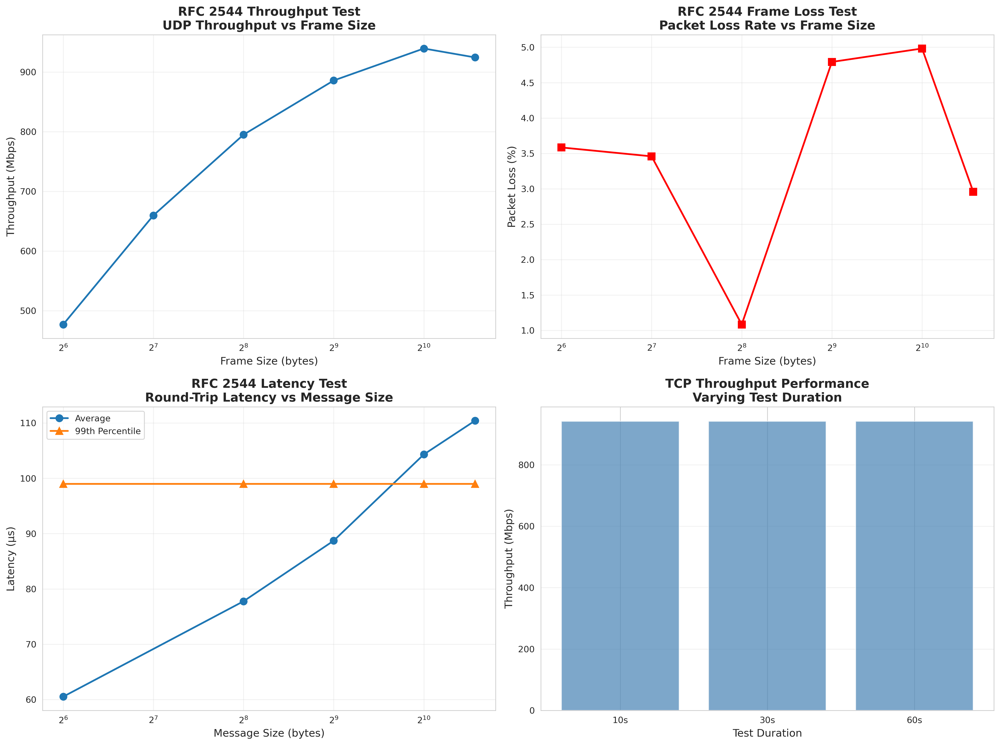
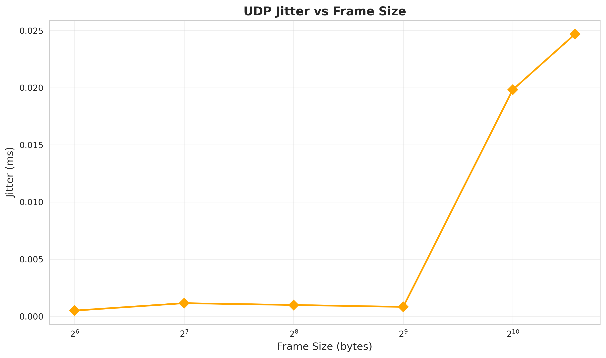

# RFC 2544 Network Benchmark Report

**Target IP:** 10.0.100.2

**Interface:** enp2s0

**Test Date:** 2025-10-20 14:34:54

**Test Duration:** 30 seconds per test

---

## Executive Summary

This report presents the results of RFC 2544 compliant network benchmarking tests performed on the target system. The tests measure key performance indicators including throughput, latency, frame loss rate, and back-to-back frame handling.

## Test 1: Throughput Measurement

### UDP Throughput (iperf3)

| Frame Size (bytes) | Throughput (Mbps) | Jitter (ms) | Packet Loss (%) | Packets Sent |
|-------------------:|------------------:|------------:|----------------:|-------------:|
| 64 | 477.00 | 0.001 | 3.584 | 27949452 |
| 128 | 659.73 | 0.001 | 3.459 | 19328071 |
| 256 | 794.99 | 0.001 | 1.083 | 11645452 |
| 512 | 885.77 | 0.001 | 4.792 | 6487630 |
| 1024 | 939.40 | 0.020 | 4.982 | 3440218 |
| 1518 | 924.43 | 0.025 | 2.957 | 2283701 |

**Summary Statistics:**

- Maximum Throughput: 939.40 Mbps (Frame size: 1024 bytes)
- Average Throughput: 780.22 Mbps
- Average Packet Loss: 3.476%
- Average Jitter: 0.008 ms

### TCP Throughput (iperf3)

| Duration (s) | Throughput (Mbps) | Retransmits |
|-------------:|------------------:|------------:|
| 10 | 941.28 | 0 |
| 30 | 941.40 | 0 |
| 60 | 941.43 | 0 |

## Test 2: Latency Measurement

### Ping-Pong Latency (sockperf)

| Message Size (bytes) | Avg Latency (μs) | 99th Percentile (μs) |
|---------------------:|-----------------:|---------------------:|
| 64.0 | 60.52 | 99.00 |
| 256.0 | 77.77 | 99.00 |
| 512.0 | 88.72 | 99.00 |
| 1024.0 | 104.32 | 99.00 |
| 1518.0 | 110.42 | 99.00 |

**Summary Statistics:**

- Minimum Avg Latency: 60.52 μs
- Maximum Avg Latency: 110.42 μs
- Overall Average: 88.35 μs

## Performance Graphs

## Conclusions

### Key Findings

1. **Maximum UDP Throughput:** 939.40 Mbps achieved with 1024-byte frames
2. **Average Packet Loss Rate:** 3.476%
   - Poor: High packet loss detected
3. **Minimum Latency:** 60.52 μs round-trip time
   - Excellent: Very low latency
4. **TCP Throughput:** 941.43 Mbps

### Recommendations

Based on the RFC 2544 benchmark results:

- Network is achieving near line-rate performance (>900 Mbps)
- Packet loss detected; check for network congestion or hardware issues

---

## Test Configuration

- **Frame Sizes Tested:** 64, 128, 256, 512, 1024, 1518 bytes
- **Test Duration:** 30 seconds per test
- **Tools Used:**
  - iperf3: Throughput measurement
  - sockperf: Latency measurement
  - mausezahn: Frame generation

**Report generated by RFC 2544 Benchmark Suite**

*Generated: 2025-10-20 14:34:54*
